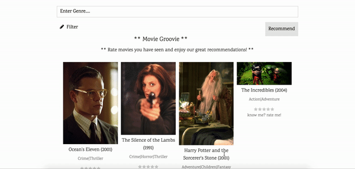
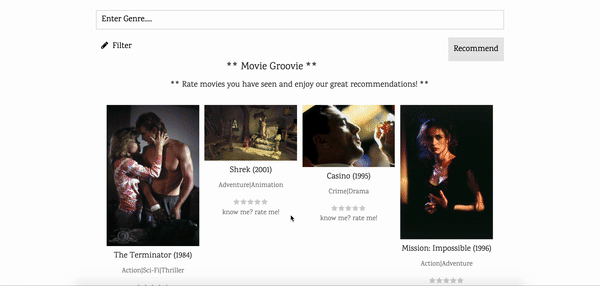

# Movie Recommender 

## A website to recommend movies based on user input

A non-negative Matrix Factorization based model recommends movies based on unlimited ratings of movies done by the user. 
On the main page, the user is randomly shown 16 of the 200 most rated movies from our database. 
They can rate those 16 movies if they have already seen, and based on their ratings, we recommend 3 top movies.

The user input is then saved to our database and the NMF model can be retrained.

Developed in Week 10 of the Spiced-Bootcamp using Python, Flask, Postgres, HTML, CSS, and using the ImdB api. 

## How to use:
- Create a virtual environment with python 3.8 (optional): conda create -n py38 python=3.8 
- Activate the virtual environment (optional): conda activate py38

- Clone the repository

- Install requirements: pip install -r requirements.txt

- setup a postgres database and import the data from the csv files you can download [here](http://files.grouplens.org/datasets/movielens/ml-latest-small.zip)

- register at [ImDb](https://www.imdb-api.com ) and get an API key

- enter database connection parameters and API key into the config.json file (see example data in the config.json file) 

- to run: python application.py 

- then open a browser on the specified location

- retrain the model: python retrain_nmf_model.py

## Dataset: MovieLens dataset
https://grouplens.org/datasets/movielens/
100,000 ratings and 3,600 tag applications applied to 9,000 movies by 600 users. Last updated 9/2018.

This is a cooperation between [Aurelie Ferron](https://github.com/ferrau10) and [Marcus Schliemann](https://github.com/mscschliemann) during our Spiced Academy Data Science Bootcamp.
